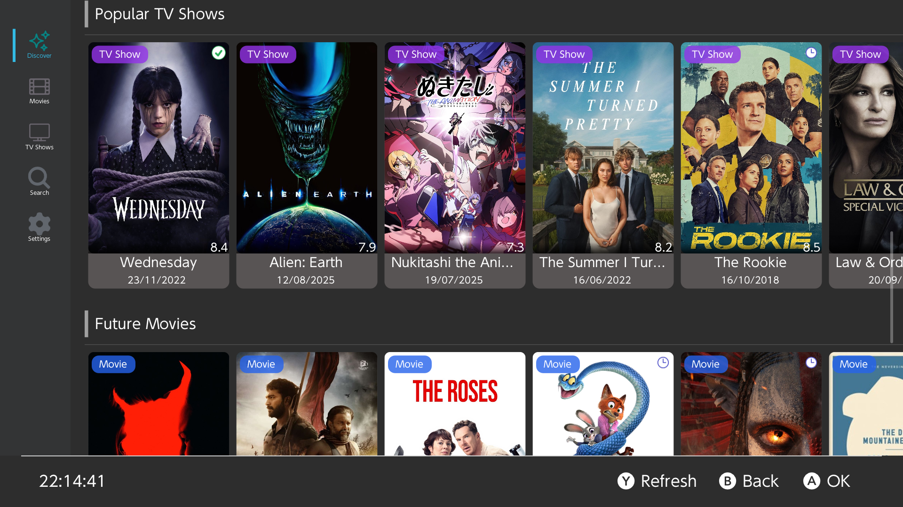

<div align="center">
    <h1>Switchseerr</h1>
    <p>Switchseerr is a third-party client for Jellyseerr for multiple platforms</p>
</div>

<p align="center">
    <a rel="LICENSE" href="https://github.com/PoloNX/Switchseerr/blob/master/LICENSE">
        
    </a>
    <a rel="VERSION" href="https://github.com/PoloNX/AtmoPackUpdater">
        
    </a>
    <a rel="BUILD" href="https://github.com/PoloNX/Switchseerr/actions">
        
    </a>
</p>

---

- [Features](#features)
- [Screenshots](#screenshots)
- [How to build](#how-to-build)
- [Todo](#todo)
- [Thanks to](#thanks-to)
- [License](#license)


## Features
- Connect to multiple Jellyseerr servers and multiple users
- Request movies and TV shows

## Screenshots



<details>
    <summary>More screenshots</summary>
    
    
    
    
</details>

## How to build

This project uses [Xmake](https://xmake.io/) as its build system. To build the project, follow these steps:

### Desktop

1. Install [Xmake](https://xmake.io/#/getting_started) on your system.
2. Clone the repository:
   ```bash
   git clone https://github.com/PoloNX/Switchseerr.git
   cd Switchseerr
   ```
3. Build the project:
    ```bash
   xmake
   ```
The built binary will be located in the `build` directory.
If you want to run it directly, you can use:
   ```bash
   xmake run
   ```

### Nintendo Switch
1. Install [Xmake](https://xmake.io/#/getting_started) on your system.
2. Install [DevkitPro](https://devkitpro.org/wiki/Getting_Started) and set up the environment.
3. Install switch dependencies:
   ```bash
   pacman -S switch-curl switch-zlib switch-glfw switch-mesa switch-glm
   ```
4. Clone the repository:
   ```bash
   git clone https://github.com/PoloNX/Switchseerr.git
   cd Switchseerr
   ```
5. Build the project:
   ```bash
   xmake f --yes -p cross -a aarch64 --toolchain=devkita64
   xmake
   ```
The built binary will be located in the `build` directory.
If you want to run it on your switch with nxlink you can use:
   ```bash
   xmake run SwitchSeerr --nx=<ip_address>
   ```

## Todo

### Platform Support
- [ ] **PlayStation 4** - Add PS4 platform support
- [ ] **Apple TV** - Add Apple TV platform support  
- [ ] **PlayStation Vita** - Add PSV platform support

### Future Enhancements
- [ ] Additional Jellyseerr features integration
- [ ] Lidarr integration
- [ ] Support for Overseerr

## Thanks to
- **[xfangfang](https://github.com/xfangfang) for [borealis](https://github.com/xfangfang/borealis) and [wiliwili](https://github.com/xfangfang/wiliwili)**
- **[dragonflylee](https://github.com/dragonflylee) for [swiftfin](https://github.com/dragonflylee/swiftfin)**
- [fallenbagel](https://github.com/fallenbagel) for [jellyseerr](https://github.com/fallenbagel/jellyseerr)

## License
This project is licensed under the MIT License. See the [LICENSE](https://github.com/PoloNX/Switchseerr/blob/master/LICENSE) file for more information.